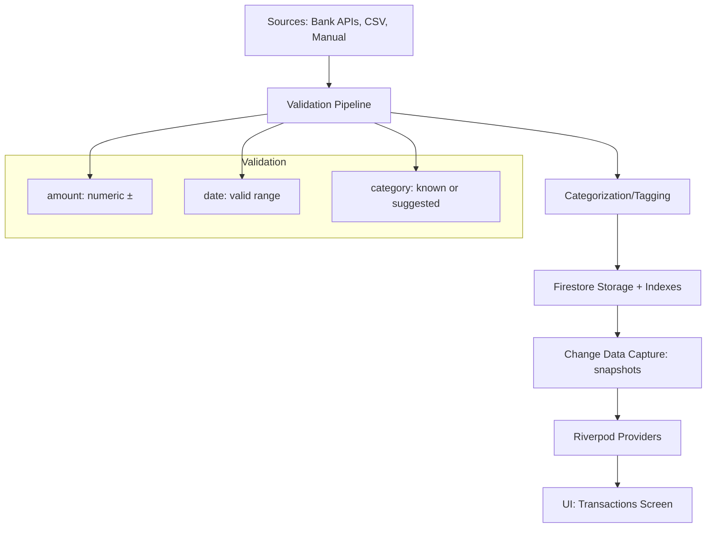
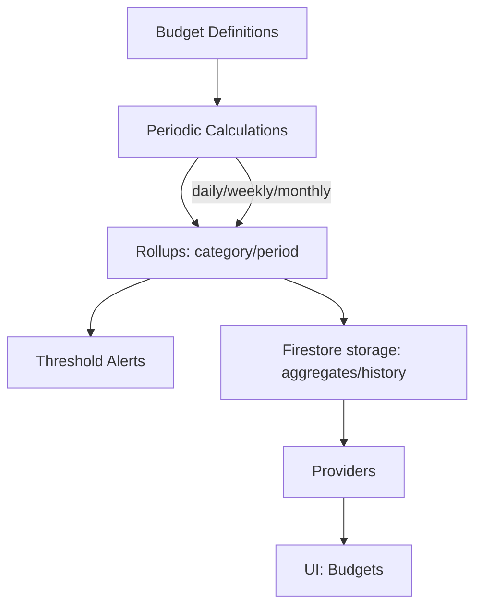
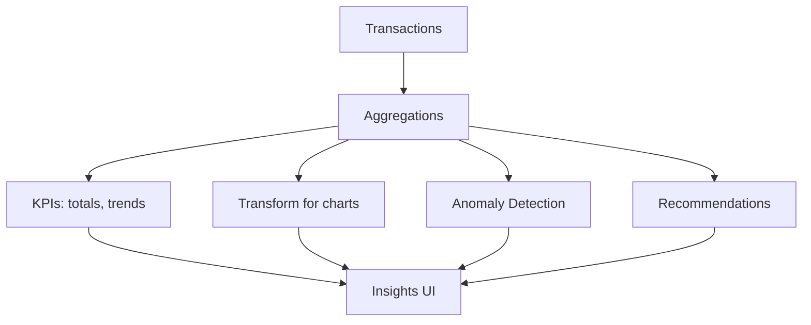
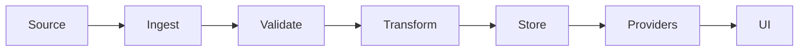

# Cashlyze – Real‑Time Data Flows

This document describes the real‑time pipelines for Transactions, Budgets, and Insights, including ingestion, validation, storage, aggregation, and UI updates. Diagrams use Mermaid for clarity.

## Transactions Flow

- Ingestion:
  - Bank APIs: handled by backend (Plaid/Yodlee) → Cloud Functions → Firestore
  - CSV: client parses and writes to Firestore
  - Manual: client adds via forms
- Real‑time: Firestore snapshots flow to Riverpod providers; UI updates instantly
- Indexes: `firestore.indexes.json` speeds `userId/date` queries

## Budgets Flow

- Calculations: client aggregates on demand; backend batch jobs can precompute
- Alerts: threshold checks in client; backend can push notifications
- History: adjustments stored in budget docs or subcollections

## Insights Flow

- Aggregations: monthly trends, category sums, income/expense splits
- Anomaly detection: simple z‑score/rolling average (client); advanced ML (backend)
- Recommendations: suggest budget adjustments based on recent spending

## Characteristics
- Real‑time: UI subscribes to Firestore; changes propagate immediately
- Batch fallback: Cloud Functions can precompute aggregates for large datasets
- Monitoring: Crashlytics; Analytics events for key actions
- Security: Firestore rules restrict per‑user docs; transport via HTTPS
- Performance: Indexed queries; lazy lists; incremental aggregations

## Lineage

- Source: Bank APIs, CSV, Manual
- Ingest: client or backend writes
- Validate/Transform: pipelines ensure correctness and categorization
- Store: Firestore with indexes
- Provide: Riverpod streams/providers
- UI: Screens reactively render

## Notes
- Email verification gating currently disabled for dev: `kRequireEmailVerification = false`
- Enable and move bank ingestion & heavy processing to backend for scale and security